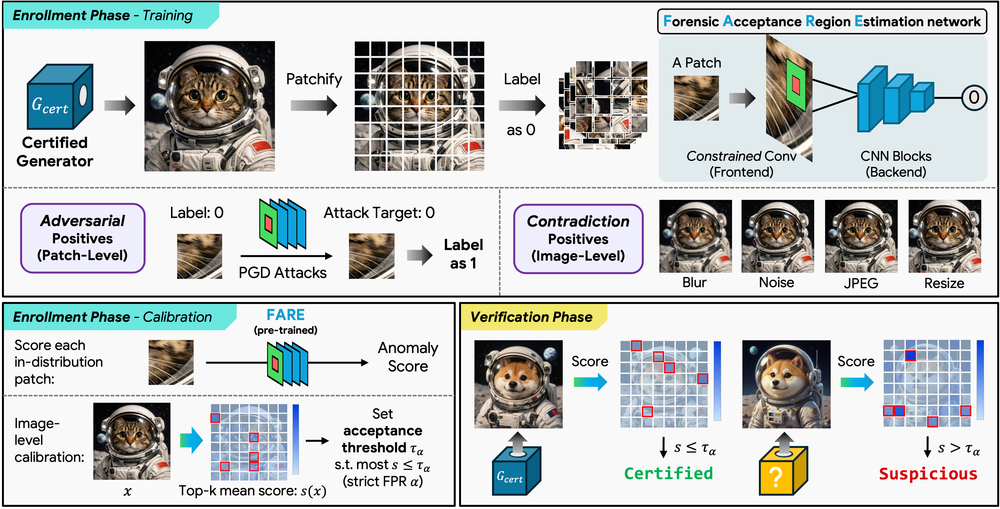

<h1 align="center">FARE</h1>
<h3 align="center">Forensic Acceptance Region Estimation<br>for Catching Bait-and-Switch Image Generators</h3>
<p align="center"><strong>NeurIPS 2026 · Accepted</strong></p>
<p align="center">Kai Yao &nbsp; · &nbsp; Marc Juarez<br>School of Informatics, The University of Edinburgh</p>
<p align="center"><a href="https://openreview.net/forum?id=biz1Z9lOtc"><strong>Paper</strong></a> &nbsp; | &nbsp; <a href="#method-overview">Method</a> &nbsp; | &nbsp; <a href="#main-results">Results</a> &nbsp; | &nbsp; <a href="#installation">Get started</a> &nbsp; | &nbsp; <a href="#citation">Citation</a></p>

---

**Checking generator integrity from images alone.** A provider can certify one image generator and silently deploy another. FARE learns the certified generator's forensic acceptance region and checks whether a queried image is consistent with it, without access to the deployed model's weights or architecture.

- **Certified-only enrollment.** Train and calibrate using images from a single certified generator.
- **Local forensic evidence.** A constrained convolutional front end and patch scoring capture generator traces; adversarial and contradiction positives tighten the acceptance region.
- **Strict operating point.** Across the four swap scenarios in Table 1, FARE achieves **92.56–99.45% scenario mean TPR at 1% FPR**. Under the evaluated perceptually constrained white-box PGD attack, scenario mean TPR remains **92.38–99.38%**.

## Method overview

<p align="center"></p>

**Figure 1. FARE.** During enrollment, certified patches are negatives. Near-boundary adversarial patches and contract-violating transformations provide certified-derived positives. Held-out certified images set the image-level threshold. During verification, FARE tiles a query image, scores each patch, averages the top-k scores, and compares the result with the calibrated threshold. The figure is reproduced from the paper.

## Main results

**Table 1. Single-image swap detection.** Values below are TPR at 1% FPR (%), reported as mean ± standard deviation across certified–swapped cases within each scenario; higher TPR is better. All task-specific fitting and calibration use only certified-generator outputs.

| Method | CF-FFHQ | CF-Diff | WF-GANTrain | WF-SDVer |
|:--|--:|--:|--:|--:|
| Deep SVDD | 12.46 ± 29.05 | 0.00 ± 0.00 | 1.23 ± 0.62 | 1.21 ± 1.06 |
| OC-SVM | 6.89 ± 15.51 | 0.00 ± 0.00 | 0.76 ± 0.49 | 2.79 ± 4.31 |
| CLIP + OC-SVM | 13.91 ± 31.48 | 0.00 ± 0.00 | 1.34 ± 0.52 | 1.73 ± 1.66 |
| DCT Fingerprint + OC-SVM | 11.46 ± 26.84 | 0.00 ± 0.00 | 0.89 ± 0.40 | 3.07 ± 4.40 |
| FSD | 8.45 ± 13.60 | 18.40 ± 3.23 | 1.02 ± 0.23 | 11.23 ± 3.57 |
| NPR + OC-SVM | 10.92 ± 15.15 | 4.60 ± 1.12 | 0.77 ± 0.31 | 18.32 ± 5.19 |
| FARE w/o Constraint | 80.57 ± 27.93 | 7.95 ± 1.85 | 31.26 ± 21.14 | 8.24 ± 4.91 |
| FARE w/o Patch | 77.26 ± 30.38 | 10.38 ± 3.48 | 11.23 ± 10.51 | 7.36 ± 4.71 |
| FARE w/o Adv | 76.60 ± 33.05 | 28.77 ± 5.18 | 79.34 ± 24.26 | 35.33 ± 18.23 |
| FARE w/o Contradiction | 68.06 ± 34.01 | 65.78 ± 8.87 | 88.92 ± 10.25 | 72.08 ± 20.75 |
| FARE w/o Adv, Contradiction | 9.91 ± 22.28 | 0.97 ± 0.55 | 1.74 ± 1.01 | 1.56 ± 2.04 |
| **FARE (full)** | **99.43 ± 1.19** | **99.45 ± 0.88** | **96.38 ± 2.77** | **92.56 ± 3.06** |
| FARE (Full, under attack) | 99.28 ± 1.35 | 99.38 ± 0.91 | 95.73 ± 2.69 | 92.38 ± 3.42 |

The first two columns measure cross-family swaps: an FFHQ-256 generator pool and the diffusion-dominated CommunityForensics pool. The last two measure within-family swaps: StyleGAN training configurations and Stable Diffusion versions. The complete FARE method outperforms the evaluated baselines across all four scenarios; the ablations show the contribution of its forensic representation and training components.

**Attack conditions.** The “under attack” row uses exact-model white-box PGD against the pretrained verifier, with an L∞ perturbation budget of 0.025 and LPIPS < 0.05. The final row of the paper's Table 1 is shown separately because it reports a different metric:

| Metric | CF-FFHQ | CF-Diff | WF-GANTrain | WF-SDVer |
|:--|--:|--:|--:|--:|
| Conditional PGD ASR (%) ↓ | 0.15 | 0.07 | 0.67 | 0.19 |

Conditional ASR is the percentage of initially detected non-certified images changed to accepted under those attack constraints. These results concern the evaluated generators and attacks; the paper discusses difficult pairs, distribution shift, and the effect of relaxing the perceptual constraint.

## Contents

The repository provides the core FARE implementation:

- the FARE network and Bayar–Stamm constrained convolution;
- training, calibration, image scoring, batch scoring, and PGD attack utilities;
- the FARE configuration and three component ablation configurations;
- a folder-based training and scoring example, and core unit tests.

## Installation

Python 3.10 or newer is recommended (the core tests also pass on Python 3.9). Install a compatible PyTorch and torchvision pair for your machine using the [official PyTorch instructions](https://pytorch.org/get-started/locally/), then run:

```bash
git clone https://github.com/kaikaiyao/FARE.git
cd FARE
python -m pip install -e ".[test]"
python -m pytest tests -q
```

For LPIPS-constrained PGD, also install `python -m pip install -e ".[attack]"`. LPIPS downloads its pretrained feature network on first use.

## Public data resources

The experiments use publicly available resources:

- [FFHQ](https://github.com/NVlabs/ffhq-dataset): the face dataset underlying the FFHQ-trained generator pool.
- [DiffusionDB](https://poloclub.github.io/diffusiondb/): prompts for the Stable Diffusion experiments.
- [Community Forensics](https://huggingface.co/datasets/OwensLab/CommunityForensics) and its [evaluation set](https://huggingface.co/datasets/OwensLab/CommunityForensics-Eval): generated images for the cross-family diffusion evaluation.

Follow each provider's download instructions and applicable terms. For FARE enrollment, use outputs from the selected certified generator, and keep training, calibration, and verification samples disjoint. The paper and appendix specify the generator pools, sampling counts, preprocessing, and evaluation settings.

## Train, calibrate, and score

Prepare three image folders:

- `certified_train/`: images from the certified generator used to train FARE;
- `certified_calibration/`: an independent image set from the same generator used only for threshold calibration;
- `query_images/`: images to test.

Acquire generator outputs from their original providers under their applicable terms. Use disjoint training and calibration samples. For the paper's evaluation protocols, generator choices, sampling counts, and operating points, see the paper and its appendix.

From the repository root:

```bash
python examples/train_and_score.py \
  --train /path/to/certified_train \
  --calibration /path/to/certified_calibration \
  --query /path/to/query_images \
  --output outputs/fare \
  --device cuda
```

The example converts images to RGB and resizes them to 256×256. It uses `configs/methods/fare.yaml`, trains on certified images, calibrates the single-image threshold at the configured target FPR, and writes a model, calibration metadata, and per-image scores to the output directory. A score above the calibrated threshold is rejected. Calibration targets an operating point; it does not guarantee the exact population FPR on a finite sample or under distribution shift.

The supplied configuration specifies **1,000,000 training steps** and a 2,000-step warmup. To check the setup, add `--max-steps 2 --device cpu`; a two-step run only checks execution and does not produce a trained verifier or reproduce paper results. Component ablations can be selected with `--config configs/methods/fare_no_adv.yaml`, `fare_no_bsconv.yaml`, or `fare_no_contradiction.yaml`.

## Python API

The main interfaces are:

```python
from fare.training.fare import FAREScorer
from fare.training.calibration import quantile_threshold, calibrate_batch_thresholds
from fare.training.adversarial import pgd_forgery_attack
from fare.types import VerifierArtifact
```

`FAREScorer.fit` accepts a corpus manifest; the example shows how to create one from image folders. A saved verifier can be restored with `FAREScorer.load(VerifierArtifact.load("outputs/fare/artifact.json"), device=...)`. For PGD evaluation, pass `lpips_max=0.05` when using the paper's perceptual constraint; the default API call does not impose that constraint.

## Acknowledgments

FARE builds on the constrained convolution of [Bayar and Stamm (2016)](https://doi.org/10.1145/2909827.2930786), one-class learning, and the PyTorch ecosystem. Optional perceptual evaluation uses [LPIPS](https://github.com/richzhang/PerceptualSimilarity). These external dependencies retain their own licenses and terms.

This work was supported by the Edinburgh International Data Facility (EIDF) and the Data-Driven Innovation Programme at the University of Edinburgh. Access to EIDF was facilitated through the University of Edinburgh's Generative AI Laboratory GAIL Fellow scheme.

## Citation

```bibtex
@inproceedings{yao2026fare,
  title = {{FARE}: Forensic Acceptance Region Estimation for Catching Bait-and-Switch Image Generators},
  author = {Yao, Kai and Juarez, Marc},
  booktitle = {Advances in Neural Information Processing Systems},
  year = {2026},
  note = {Accepted},
  url = {https://openreview.net/forum?id=biz1Z9lOtc}
}
```
